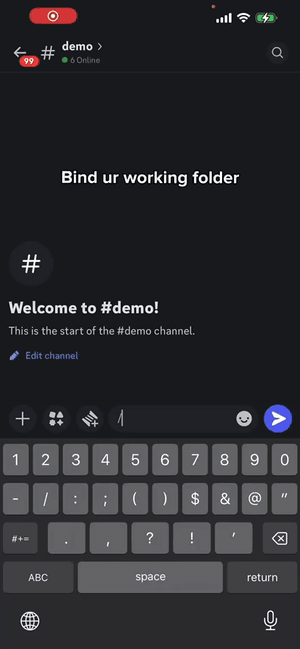

<p align="center">
  
</p>

<h1 align="center">Ghost in the Shell (GITS)</h1>

<p align="center">
  Control AI coding agents on your machine — from Discord, on any device.
</p>

---

Watch your AI write code, review its terminal output, and approve permission prompts — all from your phone via Discord.

<p align="center">
  
</p>

---

## Key Features

- **Desktop ↔ mobile continuity** — start a session on your Mac, walk away, and pick it up on your phone; the AI keeps working while you switch devices
- **Remote control from anywhere** — bind a project directory to a Discord channel; every message you type is forwarded to the coding CLI running on your machine
- **Terminal screenshots** — `/screenshot` sends a live snapshot of the terminal directly into Discord
- **Interactive prompts as buttons** — when the CLI asks for permission, it becomes a Discord button you tap to approve or deny
- **Multi-CLI support** — works with Claude Code, Codex CLI, and OpenCode; switch between them per channel
- **Threads & isolated worktrees** — `/fork` spins up a sub-task thread backed by a fresh git worktree, keeping parallel work cleanly separated
- **Session resume** — reconnecting to a directory shows a session picker so you can continue where you left off
- **tmux-backed sessions** — each project runs in a real tmux window; developers get full terminal access locally while GITS handles the Discord bridge
- **Subscription-safe** — GITS drives the official CLI tools (Claude Code, Codex) exactly as a human would; no API key required, no terms-of-service gray area — your existing Pro/Max subscription just works

---

## Quick Start

**1. Install**

```bash
git clone https://github.com/AI4Life-Institute/ghost-in-the-shell.git
cd ghost-in-the-shell
uv sync
```

System requirements: Python >= 3.12, tmux, uv

**2. Install a coding CLI (at least one)**

| CLI | Install |
|---|---|
| Claude Code | `npm i -g @anthropic-ai/claude-code` |
| Codex | `npm i -g @openai/codex` |
| OpenCode | `curl -fsSL opencode.ai/install \| bash` |

**3. Configure**

Create `.env` in the project root:

```bash
# Required
GITS_DISCORD_TOKEN=your-bot-token
ALLOWED_GUILDS=["your-server-id"]

# Optional
ALLOWED_USERS=["restrict-to-user-id"]
TMUX_SESSION_NAME=gits
LOG_LEVEL=INFO
```

The Discord bot needs **Message Content Intent** enabled and must be invited with permissions to send messages and create threads.

**4. Start**

```bash
gits start
```

Hooks are auto-installed on first start. For dev mode with auto-restart on file changes:

```bash
gits start --dev
```

---

## Usage

### Basic workflow

1. Create a Discord channel (e.g. `#my-feature`)
2. `/bind /path/to/project` — launches the CLI in a tmux window
3. Type in the channel — messages are forwarded to the CLI
4. CLI responses stream back to Discord automatically
5. Permission prompts appear as buttons — tap to approve or deny
6. `/screenshot` to see the terminal at any time
7. `/kill` when done

### Commands

| Command | Description |
|---|---|
| `/bind <path> [mode] [cli]` | Bind channel to a project, launch CLI |
| `/unbind` | Unbind and close the window |
| `/status` | Show binding status and session info |
| `/screenshot` | Send a terminal screenshot |
| `/esc` | Send Escape key (interrupt current operation) |
| `/kill` | Close window and archive thread |
| `/new [message]` | Reset CLI session |
| `/bash <command>` | Run a shell command in the project directory |
| `/keys <keys>` | Send keystrokes (Enter, Escape, Ctrl-C, Up, Down…) |
| `/model [name]` | Switch model (sonnet, opus, haiku, o3, gpt-4o…) |
| `/mode <mode>` | Switch permission mode without restarting |
| `/thread <message>` | Create a sub-thread sharing the same directory |
| `/fork <title>` | Create a sub-thread with an isolated git worktree |
| `/browse <goal>` | Run a browser agent task |
| `/compact` `/clear` `/cost` `/diff` `/memory` `/context` `/usage` | Forwarded directly to the CLI |
| `/cc <command>` | Forward any slash command to the CLI |

### Permission modes

`/bind` supports `default` and `bypassPermissions`. `/mode` also adds:

| Mode | Behavior |
|---|---|
| `default` | Normal interactive — prompts require approval |
| `bypassPermissions` | YOLO — auto-approve all operations |
| `auto` | Auto-run tools, prompt for file edits |
| `acceptEdits` | Auto-accept file edits |

---

## Docs

See [docs/architecture.md](docs/architecture.md) for architecture, internals, and configuration reference.

---

## License

MIT — © 2026 [ai4life institute](https://github.com/AI4Life-Institute)
