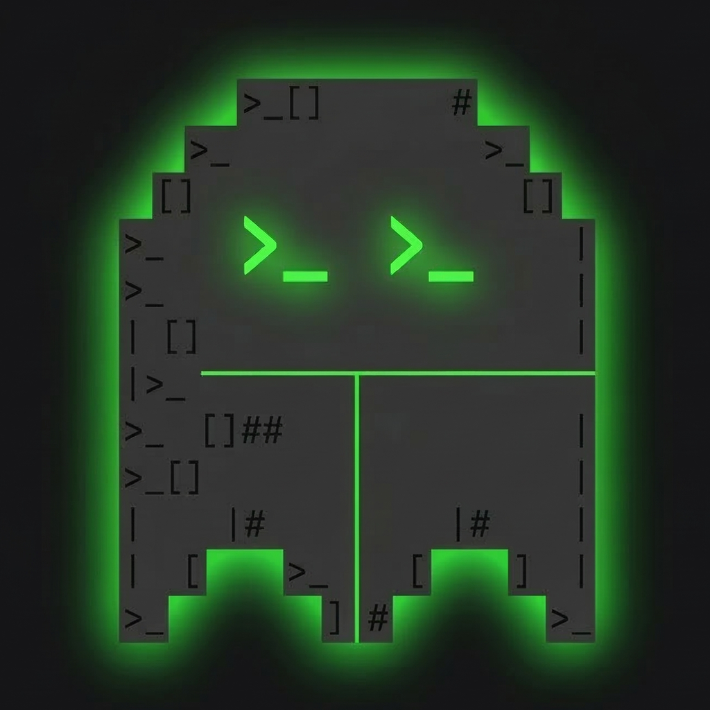

<p align="center">
  
</p>

# Ghost in the Shell (GITS)

Control coding CLIs (Claude Code / Codex / OpenCode) from Discord. Send messages, receive responses, handle interactive prompts, take screenshots — all from Discord.

## Dependencies

**System:** Python >= 3.12, tmux, uv (recommended)

**Coding CLI (install at least one):**

| CLI | Install | Hook setup |
|---|---|---|
| Claude Code | `npm i -g @anthropic-ai/claude-code` | `gits hook --install` |
| Codex | `npm i -g @openai/codex` | `gits hook --install-codex` |
| OpenCode | `curl -fsSL opencode.ai/install | bash` | `gits hook --install-opencode` |

## Install

```bash
git clone https://github.com/AI4Life-Institute/ghost-in-the-shell.git
cd ghost-in-the-shell
uv sync
```

## Configure

Create `.env`:

```bash
# Required
GITS_DISCORD_TOKEN=your-bot-token
ALLOWED_GUILDS=["your-server-id"]

# Optional
ALLOWED_USERS=["restrict-to-user-id"]
TMUX_SESSION_NAME=gits
LOG_LEVEL=INFO
```

The Discord bot needs **Message Content Intent** enabled and must be invited to your server with permissions to send messages and create threads.

## Install hooks

Hooks let GITS track CLI session IDs so responses can be forwarded back to Discord.

**All hooks are auto-installed on `gits start`**, so manual setup is usually not needed. To install individually:

```bash
gits hook --install           # Claude Code (SessionStart hook in ~/.claude/settings.json)
gits hook --install-codex     # Codex (hooks.json + codex_hooks feature flag)
gits hook --install-opencode  # OpenCode (plugin in opencode.json config)
```

## Start

```bash
gits start
```

## Usage

### Basic workflow

1. Create a Discord channel (e.g. `#my-feature`)
2. Run `/bind /path/to/project` — creates a tmux window and launches the CLI
3. Type in the channel — messages are forwarded to the CLI
4. CLI responses are automatically forwarded back to Discord
5. Interactive prompts (permission requests, etc.) become Discord buttons
6. `/screenshot` to see the terminal
7. `/kill` when done

### Discord commands

| Command | Description |
|---|---|
| `/bind <path> [mode] [cli]` | Bind channel to a project directory, launch CLI |
| `/unbind` | Unbind and close the window |
| `/screenshot` | Terminal screenshot |
| `/stop` | Send Escape (interrupt current operation) |
| `/kill` | Close window and archive thread |
| `/new` | Reset CLI session |
| `/bash <command>` | Run shell command in project directory |
| `/keys <keys>` | Send keystrokes (Enter, Escape, Ctrl-C, Up, Down, etc.) |
| `/model [name]` | Switch model (sonnet, opus, haiku, etc.) |
| `/fork <title>` | Create a sub-task thread |
| `/compact` `/clear` `/cost` `/diff` | Forwarded to the CLI |
| `/cc <command>` | Forward any command to the CLI |

### Bind modes

- **default** — normal interactive mode
- **bypassPermissions** (YOLO) — auto-approve all operations

### Session resume

When you `/bind` a directory with existing sessions, GITS shows a session picker. You can resume a previous session or start fresh.

## Technical docs

See [docs/architecture.md](docs/architecture.md) for architecture, internals, and configuration reference.

## License

MIT
